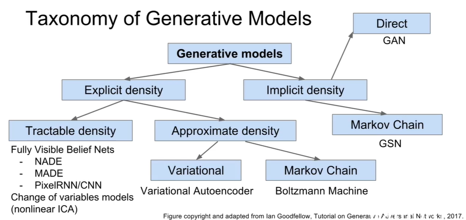
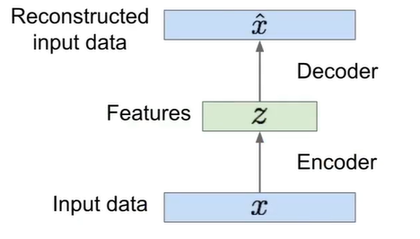
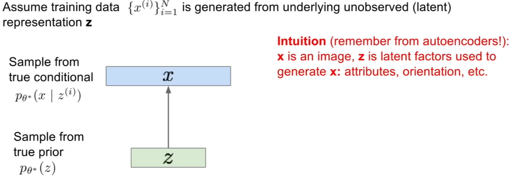
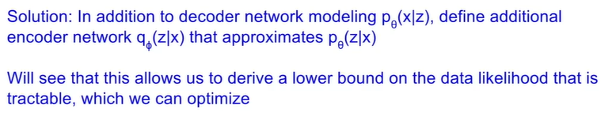
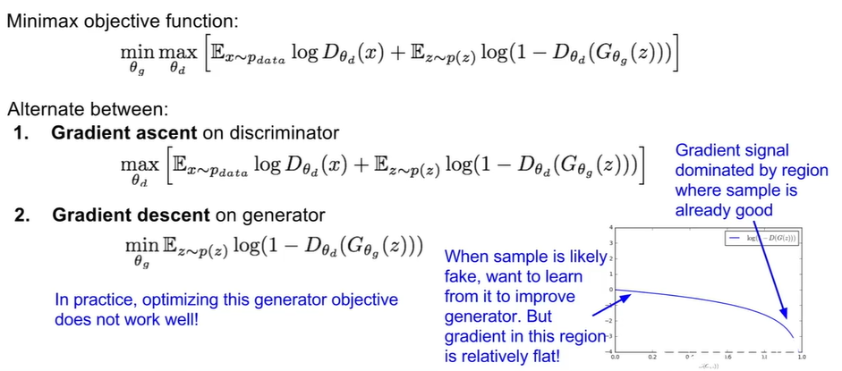
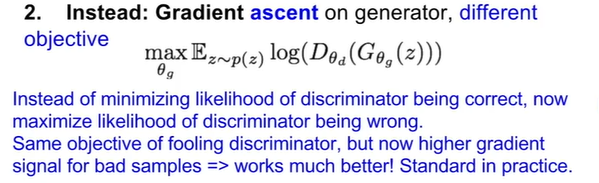
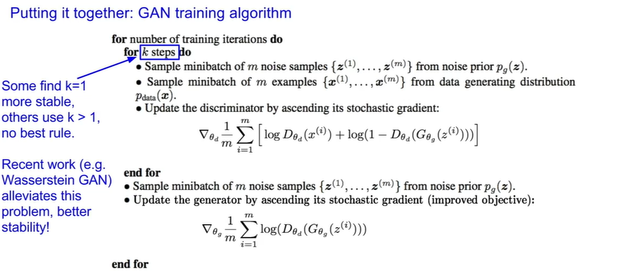
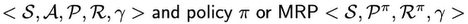
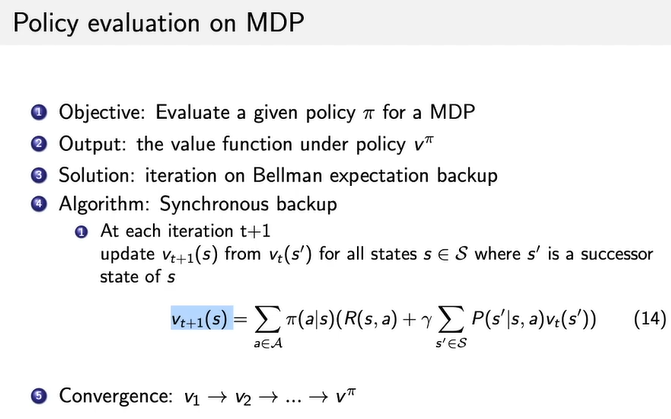

## CS-231n Generative Models L13

### Overview

- Unsupervised Learning
- Generative Models
  - [PixelRNN](###PixelRNN) and [PixelCNN](###PixelCNN)
  - [Variational Autoencoders (VAE)](###Summary VAE)
  - [Generative Adversarial Networks (GAN)](###GAN)

|          |                     Supervised Learning                      |                    Unsupervised Learning                     |
| :------: | :----------------------------------------------------------: | :----------------------------------------------------------: |
|   Data   |                 (x,y) x is date, y is label                  |                         x No Labels!                         |
|   Goal   |                 Learn a function to map x->y                 | Learn some underlying hidden *structure* of the data   Holy Grail is to understand it. |
| Examples | classification, regression, object detection,semantic segmentation, image captioning etc. | Clustering,  dimensionality reduction, feature learning, density estimation, etc. |

### Generative Models

- Given training data, generate new samples from same distribution

Training data ~ p data (x);              Generated model ~ p model (x)

Idea: want to learn p model(x) similar to p data(x)

Addresses density estimation, a core problem in unsupervised learning

- Explicit density estimation: explicitly define and solve for p model (x)
- Implicit density estimation: learn model that can sample from p model (x) we explicitly defining it

## Why generative models?

- Realistic samples for artwork, super-resolution, colorization, etc.
- Generative models of time-series data can be used for simulation and planning RL app
- Training generative models can also enable inference of latent representations that can be useful as general features

**Fully visible belief network**

Explicit density model

Use chain rule to decompose likelihood of an image x into product of 1-d distributions
$$
p(x)=\prod_{i=1}^{n}p(x_i|x_1,...,x_{i-1})
$$
Then maximize likelihood of training data.

Complex distribution over pixel values -> Express using a neural network!

### PixelRNN

- Generate image pixels starting from corner
- Dependency on previous pixels modeled using an RNN with LSTM

Drawback: sequential generation is slow!

### PixelCNN

- Still generate image pixels starting from corner
- Dependency on previous pixels now modeled using a CNN over context region
- Training: maximize likelihood of training images
- This is faster than PixelRNN (can parallelize convolutions since context region values known from training images)
- Generation must still proceed sequentially -> still slow

| Pros                                                         | Con                                       |
| ------------------------------------------------------------ | ----------------------------------------- |
| Can explicitly compute likelihood p(x)                       | Sequential generation so it could be slow |
| Explicit likelihood of training date gives good evaluation metric |                                           |
| Good samples                                                 |                                           |

Improving PixelCNN performance

- Gated convolutional layers
- short-cur connections
- Discretized logistic loss
- Multi-scale
- Training tricks

## Variational autoencoder (VAE)

Background first: Autoencoders

- Unsupervised approach for learning a lower-dimensional feature representation from unlabeled training data

Q: How to learn this feature representation?

Train such that features can be used to reconstruct original data "Autoencoding" - encoding itself

Linear, sigmoid -> Deep, FC layer -> ReLU CNN

Encoder can be used to initialize a **supervised** model

Fine-tune encoder jointly with classifier

Autoencoders can reconstruct data, and can learn features to initialize a supervised model. Features capture factors of variation in training data. Can we generate new images from an autoencoder?

Probabilistic spin on autoencoders - will let us sample from the model to generate data!

We want to estimate the true parameter $\theta^*$ of this generative model

How should we represent this model?

- Choose prior p(z) to be simple, e.g. Gaussian. Reasonable for latent attributes, eg. pose, how much smile
- Conditional p(x|z) is complex (generates image) => represent with neural network

How to train the model?

Generative models include Fully visible belief networks (FVBNs)

#### VAE: Intractability

Data likelihood: $p_{\theta}(x)=\int p_{\theta}(z)p_{\theta}(x|z)dz$​

Posterior density also intractable

Aka. Inference/Recognition network and generative network

### Summary VAE

probabilistic spin to traditional autoencoders -> allows generating data -> Defines an intractable density ->derive and optimize a variational lower bound

| Pros                                                         | Cons                                                         |
| ------------------------------------------------------------ | ------------------------------------------------------------ |
| Principled approach to generative models                     | Maximizes lower bound of likelihood: not so good evaluation as PixRNN |
| Allows inference of q(z\|x), can be useful feature representation for other tasks | Samples blurrier and lower quality compared to state-of-the-art (GANs) |

What if we give up on explicitly modeling density, and just want ability to sample?

GANs: don't work with any explicit density function! Instead, take game-theoretic approach: learn to generate from training distribution through 2-player game

### GAN

Problem: want to sample from complex, high-dimensional training distribution. No direct way to do this!

Solution: sample from a simple distribution, eg, random noise. Learn transformation to training distribution.

Q: What can we use to represent this complex transformation?

A: Neural Networks!

**Two player games in essence**

- **Generator network**: try to fool the discriminator by generating real-looking images
- **Discriminator network:** try to distinguish between real and fake images

#### GANs: Convolutional Architectures

Generator is an upsampling network with fractionally-strided convolutions. Discriminator is a convolutional network

> Architecture guidelines for stable Deep Convolutional GANs
>
> - Replace any pooling layers with strided convolutions (discriminator) and fractional-strided convolutions (generator)
> - Use batchnorm in both the generator and the discriminator
> - Remove fully connected hidden layers for deeper architectures
> - Use ReLU activation in generator for all layers except for the output (use tanh)
> - Use LeakyReLU activation in the discriminator for all layers

Interpretable Vector Math

#### Summary

Don't work with an explicit density function

Take game-theoretic approach: learn to generate from training distribution through 2-player game

|       Pros        |                        Cons                        |
| :---------------: | :------------------------------------------------: |
| Beautiful samples |           Tricker/more unstable to train           |
|                   | Can't solve inference queries such as p(x),p(z\|x) |

# Intro to RL - L4

### Decision Making in Markov Decision Process (MDP)

- Prediction (evaluate a given policy)
  - Input: MDP 
  - Output: value function $v^\pi$
- Control (search the optimal policy)
  - Input: MDP
  - Output: optimal value function v* and optimal policy $\pi^*$
- Prediction and control in MDP can be solved by dynamic programming

### Dynamic Programming

Dynamic programming is a very general solution method for problems which have two properties

- Optimal substructure
  - Principle of optimality applies
  - Optimal solution can be decomposed into subproblems
- Overlapping subproblems
  - Subproblems recur many times
  - Solutions can be cached and reused

Markov decision process satisfy both properties

- Bellman equation gives recursive decomposition
- Value function stores and reuses solutions

