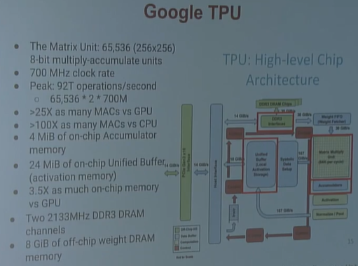

# CS231n - L14 Deep Reinforcement Learning

### Recap

- Supervised learning: learn a *function* to map x->y
- Unsupervised learning: learn the underlying hidden structure of the data

### Reinforcement learning

Problems involving an **agent** interacting with an **environment**, which provides numeric **reward** signals

**Goal:** Learn how to take actions in order to maximize reward

- [What is RL](###RL)
- [Markov Decision Processes](###MDP)
- [Q-Learning](###Q-Learning)
- [Policy Gradients](###Policy Gradients)

#### Example of Cart-Pole Problem/Robot Locomotion

**objective:** Balance a pole on top of a movable cart/Make the robot move forward

**state:** angle, angular speed, position, horizontal velocity/Angle and position of the joints

**action**: horizontal force applied on the cart/Torques applied on joints

**reward:** 1 at each time step if the pole is upright/1 at each time step upright + forward movement

### MDP

- **Markov property:** Current state completely characterises the state of the world
- $(S,A,R,\mathbb{P,\gamma})$​
- states, actions, distribution of reward given pair, transition probability, discount factor

#### The optimal policy pi*

- We want to find optimal policy pi* that maximizes the sum of rewards
- Maximize the **Expected sum of rewards**

Following a policy produces sample trajectories (or paths): s, a, r

**How good is a state**

The **value function** at state s, is the expected cumulative reward from following the policy from state s:
$$
V^{\pi}(s)=\mathbb{E}[\sum_{t\geq0}\gamma^tr_t|s_0=s,\pi]
$$
**How good is a state-action pair?**

The **Q-value function** at state s and action , is the expected cumulative reward from taking action a in state s and then following the policy:
$$
Q^{\pi}(s,a)=\mathbb{E}[\sum_{t\geq0}\gamma^tt_t|s_0=s,a_0=a,\pi]
$$

To solve for the optimal policy, we adopt **Value iteration** algorithm to use bellman equation as an iterative update. Finally, Qi will converge to Q* as i goes to infinity!

- Q: What's the problem with this?
- Not scalable. Must compute Q(s,a) for every state-action pair. If state is e.g. current game state pixels, computationally infeasible to compute for entire state space
- A: use a function estimator : A Neural Network!!!

### Q-learning

#### Experience Replay

Learning from batches of consecutive samples is problematic:

- Samples are correlated -> inefficient learning
- Current Q-network parameters determines next training samples (e.g. if maximizing action is to move left, training samples will be dominated by samples from left-hand size) -> can lead to bad feedback loops

Address these problems using **experience replay**

- Continually update a **replay memory** table of transitions as game experience episodes are played
- Train Q-network on random minibatches of transitions from the replay memory, instead of consecutive samples.

### Policy Gradients

Formally, let's define a class of parametrized policies : $\Pi=\{\pi_\theta,\theta\in\mathbb{R}^m\}$

For each policy, define its value:
$$
J(\theta)=\mathbb{E}[\sum_{t\geq0}\gamma^tr_t|\pi_\theta]
$$
Then we want to find the optimal policy. USE Gradient Ascent!!!

Now, we can differentiate this:
$$
\nabla_{\theta}J(\theta)=\int_\tau(r(\tau)\nabla_{\theta}\log p(\tau;\theta))p(\tau;\theta)d\tau\\
=\mathbb{E}_{\tau\sim p(\tau;\theta)}[r(\tau)\nabla_{\theta}\log p (\tau;\theta)]
$$

Thus, this is considered as the gradient estimator.

**Interpretation:**

- If r is high, push up the prob of the actions seen
- If r is low, push down the prob of the actions seen

### Variance reduction

1. Push up probabilities of an action seen, only by the cumulative future reward from that state
2. Use discount factor to ignore delayed effect

3. Using a Baseline
   - The raw value of a trajectory isn't necessarily meaningful. What is important is that whether a reward is better or worse than what you expect to get
   - Introduce a baseline function dependent on the state. Concretely, estimator is now:

A simple baseline: constant moving average of rewards experienced so far from all trajectories.

**Better baseline???**

Intuitively, we are happy with an action a in a state s if $Q^\pi(s_t,a_t)-V^\pi(s_t)$ is large. On the contrary, we are unhappy with an action if it's small.

### REINFORCE in action: recurrent attention model (RAM)

O: Image classification

Take a sequence of "glimpses" selectively focusing on regions of the image, to predict class

- Inspiration from human perception and eye movements
- Saves computational resources -> scalability
- Able to ignore clutter/irrelevant parts of image

S: Glimpses seen so far

A: (x,y) coords of where to look next in image

R: 1 at the final timestep if image correctly classified, 0 otherwise

*Caveat:* glimpsing a is a non-differentiable operation -> learn policy for how to take glimpse actions using rl given state of glimpses seen so far, use RNN to model the state and output next action.

- RAM has also been used in many other tasks including fine-grained image recognition, image captioning, and visual question-answering!

## Summary

- **Policy gradients:** very general but suffer from high variance so requires a lot of samples. (sample-efficiency)
- **Q-learning:** does not always work but when it works, usually more sample-efficient (exploration)
- Guarantees: 
  - Converges to a local minima of J, often good enough!
  - Q-learning: 0 guarantees since you are approximating Bellman equation with a complicated function approximator.

# CS 231n - L15 Efficient Methods and Hardware for deep learning

Aiming to get Efficient Methods for Deep Neural networks.

- Image recognition 16*
- Baidu 10*

1. Model size

Hard to distribute large models through over-the-air update

2. Speed 

**Where is the energy consumed?**

larger model -> more memory reference -> More energy

Solution: we can improve the efficiency of deep learning by Algorithm-Hardware Co-Design

FPGA: Field programmable gate array.

ASIC: Application specific integrated circuit.

## Algorithms for Efficient Inference

1. Pruning
2. Weight sharing
3. Quantization
4. Low Rank Approximation
5. Binary / Ternary Net
6. Winograd Transformation

#### Pruning

Pruning Neural Networks basically mean pruning synapses and neurons.

Train connectivity -> prune connections <-> train weights

#### Weight Sharing

Cluster the weights -> generate code book -> Quantize the Weights with Code book <-> Retrain Code book

32 bits -> 4 bit 

**Huffman Coding**

- In-frequent weights: use more bits to represent
- Frequent weights: use less bits to represent

#### Quantization

- Quantizing the Weight and Activation
- Train with float
- Quantizing the weight and activation
  - Gather the statistics for weight and activation
  - Choose proper radix point position
- Fine-tune in float format
- Convert to fixed-point format

#### Low Rank Approximation for CONV

#### Binary / Ternary net

#### Winograd Convolution

## Hardware for Efficient Inference

a common goal: minimize memory access

- Eyeriss MIT Dataflow
- DaDiannao CAS eDRAM
- TPU
- EIE

> A linear activation function can be used, however on very limited occasions. In fact to understand activation functions better it is important to look at the ordinary least-square or simply the linear regression. A linear regression aims at finding the optimal weights that result in minimal vertical effect between the explanatory and target variables, when combined with the input. In short, if the expected output reflects the linear regression as shown below then linear activation functions can be used: (Top Figure). But as in the second figure below linear function will not produce the desired results:(Middle figure). However, a non-linear function as shown below would produce the desired results.
>
> Activation functions cannot be linear because neural networks with a linear activation function are effective only one layer deep, regardless of how complex their architecture is. Input to networks is usually linear transformation (input * weight), but real world and problems are non-linear. To make the incoming data nonlinear, we use nonlinear mapping called activation function. An activation function is a decision making function that determines the presence of a particular neural feature. It is mapped between 0 and 1, where zero means absence of the feature, while one means its presence. Unfortunately, the small changes occurring in the weights cannot be reflected in the activation values because it can only take either 0 or 1. Therefore, nonlinear functions must be continuous and differentiable between this range. A neural network must be able to take any input from -infinity to +infinite, but it should be able to map it to an output that ranges between {0,1} or between {-1,1} in some cases - thus the need for activation function. Non-linearity is needed in activation functions because its aim in a neural network is to produce a nonlinear decision boundary via non-linear combinations of the weight and inputs.

Why so far below Rooflines?

Low latency req. -> cannot batch more -> low ops/byte

How to solve this?

less memory footprint -> need compress the model

**Produce hardware that can infer on compressed model**

EIE: the first DNN accelerator for sparse, compressed model.

## Efficient Training - Algorithm

1. Parallelization
2. Mixed Precision with FP16 and FP32
3. Model Distillation
4. DSD: Dense-Sparse-Dense Training

Data Parallel - RUN multiple inputs in parallel

- Doesn't affect latency for one input
- Requires P-fold larger batch size\
- For training requires coordinated weight update

Hyper-parameter parallelism

#### Summary of Parallelism

- Lots of parallelism in DNNs
  - 16M independent multiplies in one FC layer
  - Limited by overhead to exploit a fraction of this
- Data parallel
  - Run multiple training examples in parallel
  - Limited by batch size
- Model parallel
  - Split model over multiple processors
  - By layer
  - Conv layers by map region
  - FC layers by output activation

- Easy to get 16-64 GPUs training one model in parallel

#### Mixed Precision with FP16 and FP32

#### Model Distillation

#### DSD

It produces same model architecture but can find better optimization solution, arrives at better local minima, and achieves higher prediction accuracy across a wide range of deep neural networks on CNNs/RNNs/LSTMs

**Computation and memory bandwidth are two determining factors of overall performance**

## Wrap-up

