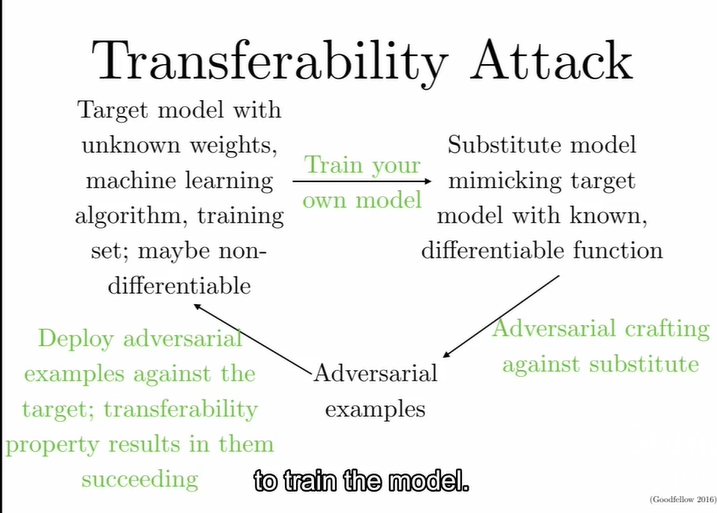
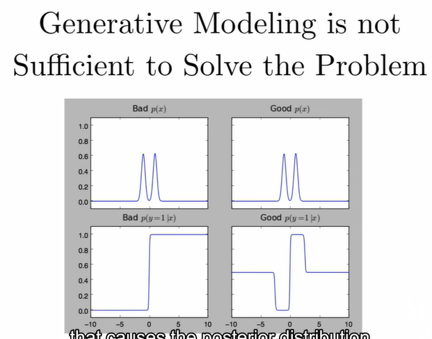

# CS231n - L16 Adversarial example and adversarial training

### Overview

- what are adversarial examples
- why do they happen
- how can they be used to compromise machine learning systems
- what are the defenses
- how to use adversarial examples to improve machine learning, even when there is no adversary

Turning objects into airplanes: Deep learning has deep flaws

### Not just for neural nets that are vulnerable to malicious attack

- Linear models
  - Logistic regression
  - Softmax regression
  - SVMs
- Decision trees
- Nearest neighbors

Systematic effects rather than random effects

- Adversarial examples are more like underfitting against overfitting.

### Modern deep nets are very piecewise linear

- Rectified linear unit
- Maxout
- Carefully tuned sigmoid
- LSTM (RNN network)

The mapping from the input to the output is linear and predictable (relative to a model) 

The mapping from the parameters of the network to the output is non-linear

### The Fast Gradient Sign Method

$$
J(\tilde{x},\theta)\approx J(x,\theta)+(\tilde{x}-x)^T\nabla J(x)
$$

Maximize the right term subject to 
$$
||\tilde{x}-x||_{\infty}\leq\epsilon
$$

$$
\tilde{x}=x+\epsilon sign(\nabla_xJ(x))
$$

### RBF (Radial basis function) network

It behaves well as in the realm of quadratic model. It is able to resist adversarial perturbations very well. But it is a shallow model which basically is just a template matcher.

### Adversarial Training of other Models

- Linear models: SVM/ linear regression cannot learn a step function, so adversarial training is less useful, very similar to weight decay.
- KNN: adversarial training is prone to overfitting
- Takeaway: neural nets can actually become more secure than other models. *Adversarially trained neural nets have the best empirical success rate on adversarial examples of any machine learning model.*

### Conclusion:

- Attacking is easy
- Defending is difficult
- Adversarial training provides regularization and semi-supervised learning
- The out-of-domain input problem is a bottleneck for model-based optimization generally.

