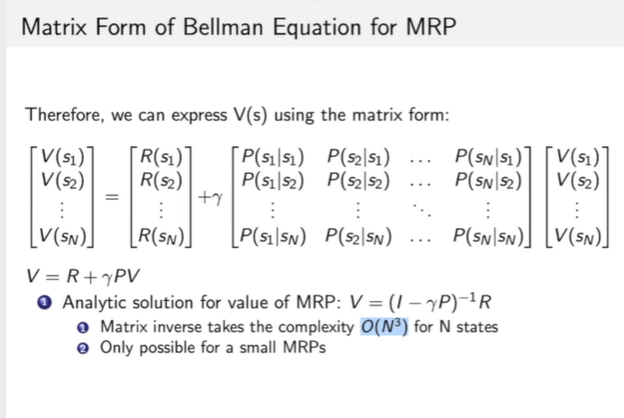

**2021-7-28**

# CS-231n L9 CNN-Architectures

paddle (Baidu), CNTK (Microsoft), MXNet (Amazon)

1. Easily build big computational graphs
2. Easily compute gradients in computational graphs
3. Run it all efficiently on GPU (cuDNN, cuBLAS, etc)

### AlexNet

Input: 227 * 227 * 3 images

**First layer** (CONV1): 96 (number) 11*11 filters applied at stride 4 ->

Output volume: (227-11)/4+1=55, 55 * 55 * 96

Total number of parameters in this layer: (11 * 11 * 3) * 96 = 35k

**Second layer (POOL1)**: 3 * 3 filters applied at stride 2

Output volume: (55-3)/2+1 = 27, 27 * 27 * 96 (NO convolution operation) -- <u>pooling preserves depth</u> 

Total number of parameters in this layer: (3 * 3 * 96) * 96 (WRONG!!!) There is no parameters that we need to learn at our pooling layer. Cuz in pooling we just take the max

#### Details/Retrospectives

- first use of ReLU
- used Norm layers
- heavy data augmentation
- dropout 0.5
- batch size 128
- SGD Momentum 0.9
- learning rate 1e-2, reduced by 10 manually when val accuracy plateaus
- L2 weight decay 5e-4
- 7 cnn ensemble 18.2% -> 15.4%

### VGGNet

- Small filter, Deeper networks
- 16 - 19 layers
- Only 3*3 conv stride1 , pad 1 and 2 * 2 MAX POOL stride 2

Q: Why use smaller filters? (3*3 conv)

Stack of three 3*3 conv (stride 1) layers has same **effective receptive field** as one 7 * 7 conv layer

Q: What is the effective receptive field of three 3 * 3 conv (Stride 1) layer

7 * 7 conv layer

Q: Why use smaller filters? (3 * 3 conv)

Stack of three 3*3 conv (stride1) layers has same effective receptive field as one 7 * 7 conv layer

But deeper with more non-linearities

And fewer parameters : 3 * (3^3C^2) vs 7^2C^2 for C channels per layer

#### "Depth"

- depth rate per channel
- depth of the network: total number of weight layers (trainable) --- Conv layers and Fully connected layers

Details:

- ILSVRC'14 2nd in classification, 1st in localization
- Similar training procedure as Krizhevsky 2012
- No Local Response Normalization (LRN)
- Use ensembles for best results
- FC7 features generalize well to other tasks

### .GoogLeNet

*Deeper networks, with computational efficiency*

- 22 layers
- efficient "Inception" module
- NO FC layers
- Only 5 million parameters! 12x less than AlexNet
- ILSVRC'14 classification winner

"Inception module": design a good local network topology (network within a network) and then stack these modules on top of each other

Apply parallel filter operations on the input from previous layer:

- Multiple receptive field sizes for convolution
- Pooling operation

Then, we concatenate all filters outputs together depth-wise

Q: What is the problem with this? [Computational complexity]

[1 * 1 conv, 128] 28 * 28 * 128 * 1 *1 * 256

[3 * 3 conv, 192] 28 * 28 * 192 * 3 * 3 * 256

[5 * 5 conv, 96] 28 * 28 * 96 * 5 * 5 * 256 

[854M ops]

Very expensive compute. Pooling layer also preserves feature depth, which means total depth after concatenation can only grow at every layer!

Solution: "bottleneck" layers that use 1 * 1 convolutions to reduce feature depth

### ResNet 

*Revolution of Depth: Very deep networks using residual connections*

- 152-layer model for ImageNet
- ILSVRC'15 classification winner
- Swept all classification and detection competitions 

What happens when we continue stacking deeper layers on a plain cnn?

56-layer network is worse than 27-layer network

Hypothesis: the problem is an optimization problem,deeper models are harder to optimize

- The deeper model should be able to perform at least as well as the shallower model.
- A solution by construction is copying the learned layers from the shallower model and setting additional layers to identity mapping.

Solution: Use network layers to fit a residual mapping instead of directly trying to fit a desired underlying mapping

Full ResNet architecture:

- Stack residual blocks
- Every residual block has two 3 * 3 conv layers
- Periodically, double the number of filters and downsample spatially using stride 2 
- Additional conv layer at the beginning
- No FC layers at the end (FC 1000 to output classes)
- also use bottleneck layer to improve efficiency (Google Net)

##### Training ResNet in practice

- Batch Normalization after every conv layer
- Xavier/2 initialization 
- SGD + Momentum
- Learning rate: 0.1, /10 when validation error plateaus
- Mini-batch size 256
- Weight decay of 1e05
- No dropout

### Network in Network

- MLpconv layer with  "micronetwork" within each conv layer to compute more abstract features for local patches
- Micronetwork uses multilayer perceptron (FC)
- Precursor to GoogleNet and ResNet "bottleneck" layers
- Philosophical inspiration for GoogleNet

### Identity Mappings in Deep Residual Networks

### Wide Residue Networks (more filters)

- More computationally efficient / parallelizable

### Aggregated Residual Transformations for Deep Neural Networks

- Also from creators of ResNet
- Increases width of residual block through multiple parallel pathways "cardinality"
- Parallel pathways similar in spirit to Inception module

### Deep Networks with Stochastic Depth

- Motivation: to reduce vanishing gradients and training time through short networks during training
- Randomly drop a subset of layers during each training pass
- Bypass with identity function
- use full deep network at test time

### FractalNet: Ultra-Deep Neural Networks without Residuals

### Densely Connected Convolutional Networks

- Dense blocks where each layer is connected to every other layer in feedforward fashion
- Alleviates vanishing gradient, strengthens feature propagation,encourages feature reuse

### SqueezeNet (Efficient networks)

- Fire modules consisting of a 'squeeze'
- fewer parameters
- less space storage (occupancy)

# Intro to RL - L3

- [Decision Making in MDP](##Decision Making in MDP)
  - Markov Chain -> [Markov Reward Process](###Markov Reward Process) -> [Markov Decision Processes (MDP)](##MDP)
  - [Policy evaluation in MDP](##Policy in MDP)
  - [Value function for MDP](###Value function for MDP)
  - Control in MDP: policy iteration and value iteration

## Decision Making in MDP

- MDP can model a lot of real-world problem. It formally describes the framework of reinforcement learning
- Under MDP, the environment is fully observable.
  - Optimal control primarily deals with continuous MDPs
  - Partially observable problems can be converted into MDPs

### Markov Property

- The history of states: $h_t=\{s_1,s_2,...,s_t\}$

- State $s_t$ is Markovian if and only if:
  $$
  p(s_{t+1}|s_t)=p(s_{t+1}|h_t) \\ p(s_{t+1}|s_t,a_t)=p(s_{t+1}|h_t,a_t)
  $$
  
- "The future is independent of the past given the present"

### Markov Reward Process

- Markov Reward Process is a Markov Chain + reward
- Def:
  - S is a finite set of states ($s\in S$)
  - P is dynamics/transition model that specifies $P(S_{t+1}=s'|s_t=s)$
  - R is a reward function $R(s_t=s)=E[r_t|s_t=s]$
  - Discount factor $\gamma\in[0,1]$
- If finite number of states, R can be a vector [learn the discount factor]

### Return and Value function

- Definition of Horizon

  - Number of maximum time steps in each episode
  - Can be infinite, otherwise called finite MRP

- Def of Return

  - Discounted sum of rewards from time step t to horizon

    $G_t=R_{t+1}+\gamma R_{t+2} +\gamma^2 R_{t+3}+\gamma^3 R_{t+2}+...+\gamma^{T-t-1}R_T$

- Def of state value function $V_t(s)$ for a MRP
  - Expected return from t in state s $V_t(s)=E[G_t|s_t=s]$
  - Present value of future rewards

### Computing the value of a Markov Reward Process

- MRP value function satisfies the following **Bellman equation**
- $V(s)=R(s)+\gamma\sum_{s'\in S}P(s'|s)V(s')$
- $V_t(s)=E[R_{t+1}+\gamma V_{t+1}(s)|s_t=s]$

### Understanding Bellman Equation for MRP

### Iterative Algorithm for Computing Value of a MRP

- Iterative methods for large MRPs:
  - Dynamic Programming
  - Monte-Carlo evaluation
  - Temporal-Difference learning

## MDP

- MDP is MRP with decisions
- Def of MDP:
  - S is a finite set of states ($s\in S$)
  - A is a finite set of actions
  - P is dynamics/transition model that specifies $P(S_{t+1}=s'|s_t=s, a_t=a)$
  - R is a reward function $R(s_t=s)=E[r_t|s_t=s,a_t=a]$
  - Discount factor $\gamma\in[0,1]$​
- MDP is a tuple (S, A, P, R, $\gamma$)

## Policy in MDP

- policy specifies what action to take in each state
- Give a state, specify a distribution over actions
- Policy: $\pi(a|s)=P(a_t=a|s_t=s)$
- Policies are stationary (time-independent), $A_t\sim\pi(a|s)$ for any $t>0$​

### Value function for MDP

- The state-value function $v^{\pi}(s)$ of an MDP is the expected return starting from state s, and following policy $\pi$

  $v^{\pi}(s)=E_{\pi}[G_t|s_t=s]$

- The action-value function $q^{\pi}(s,a)$ is the expected return starting from state s, taking action a, and then following policy $\pi$

  $q^{\pi}(s,a)=E_{\pi}[G_t|s_t=s,A_t=a]$

- We have the relation between $v^{\pi}(s)$ and $q^{\pi}(s,a)$

$$
v^{\pi}(s)=\sum_{a\in A}\pi(a|s)q^{\pi}(s,a)
$$

**Policy evaluation/prediction**: evaluate the value of state given a policy $\pi$: compute $v^{\pi}(s)$

# CS-231n L10 Recurrent Neural Networks

### Recurrent Neural Networks: Process Sequences

- One to many: image -> sequence of words (eg.) **Image Captioning**
- Many to one : sequence of words -> sentiment **Sentiment classification**
- Many to many : sequence of words -> sequence of words **Machine Translation/Video classification on frame level**
- RNN general paradigm for these problems

### Sequential processing of non-sequence data

- Notice: the same function and the **same** set of parameters are used at every time step.

- 'Vanilla': having no special or extra features; ordinary or standard

**Language modeling problem**

- At test-time sample characters one at a time, feed back to model
- Backpropagation through time:
  - Forward through entire sequence to compute loss, then backward through entire sequence to compute gradient.

### Truncated Backpropagation through time

- Run forward and backward through chunks of the sequence instead of whole sequence
- Carry hidden states forward in time forever, but only backpropagate for some smaller number of steps

Another paper is searching for interpretable cells inside a recurrent network

- Quote detection cell
- Line length tracking cell
- IF statement cell
- comment cell
- code depth cell

### Image Captioning with attention

- Focus on the salient or semantic meaningful part
- Soft and hard attention

Image captioning + NLP

### Vanilla RNN Gradient Flow

**Exploding gradients:** Gradient clipping [scale gradient if its norm is too big]

**Vanishing gradients:** LSTM Long Short Term Memory

GRU vs LSTM

## Summary

- RNNs allow a lot of flexibility in architecture design
- Vanilla RNNs are simple but don't work very well
- Common to use LSTM or GRU: additive interactions improve gradient flow
- Backward flow of gradients in RNN can explode or vanish
  - Exploding is controlled with gradient clipping. Vanishing is controlled with additive interactions (LSTM)
- Better architectures are a hot topic of current research
- Better understanding theoretical/empirical is needed!