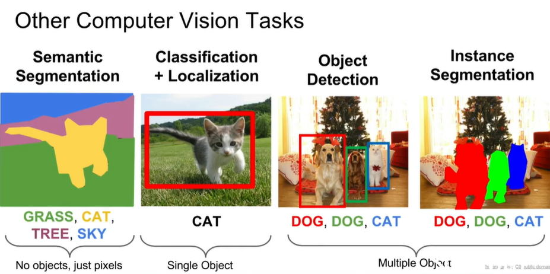
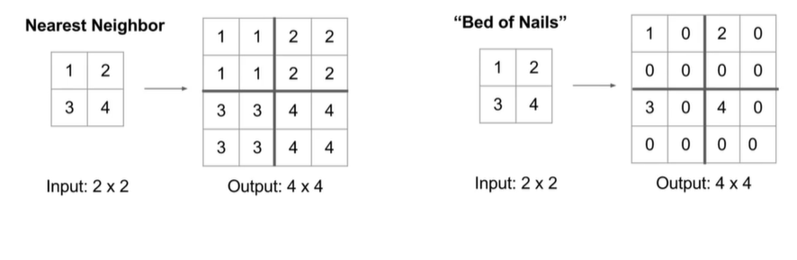
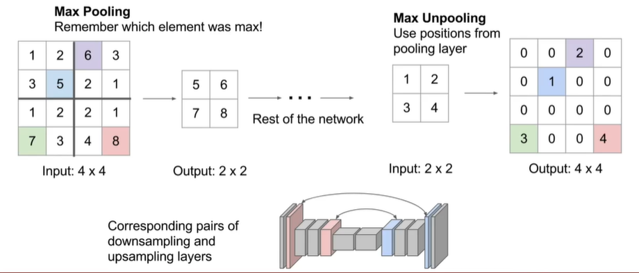
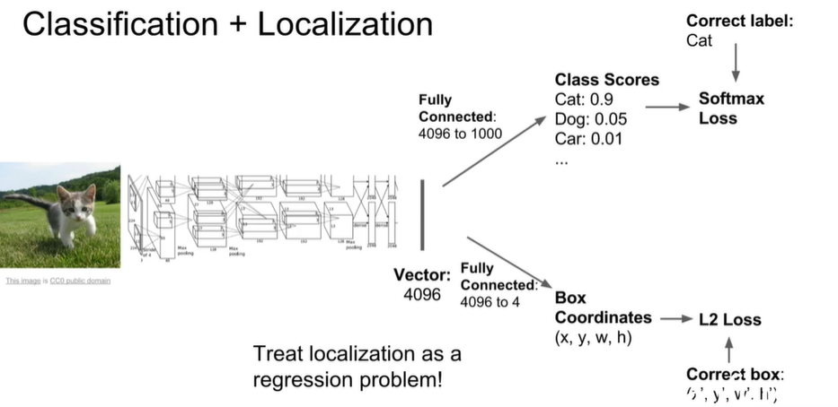
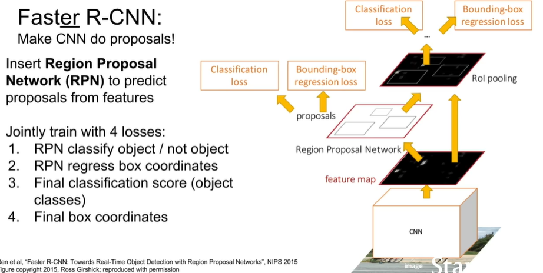
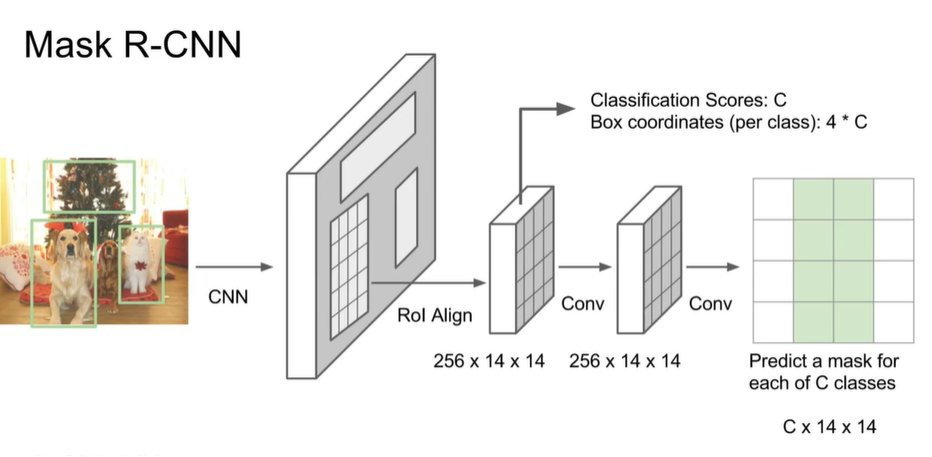
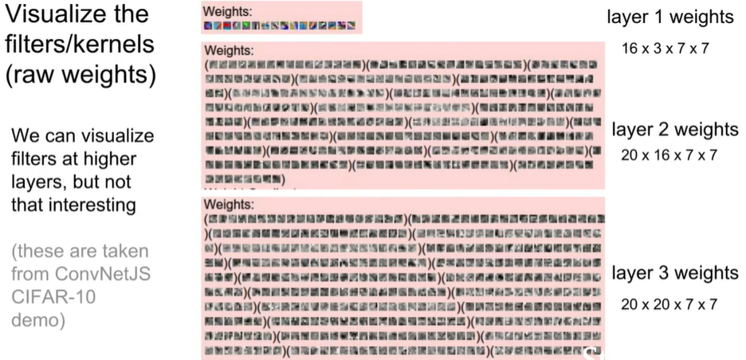
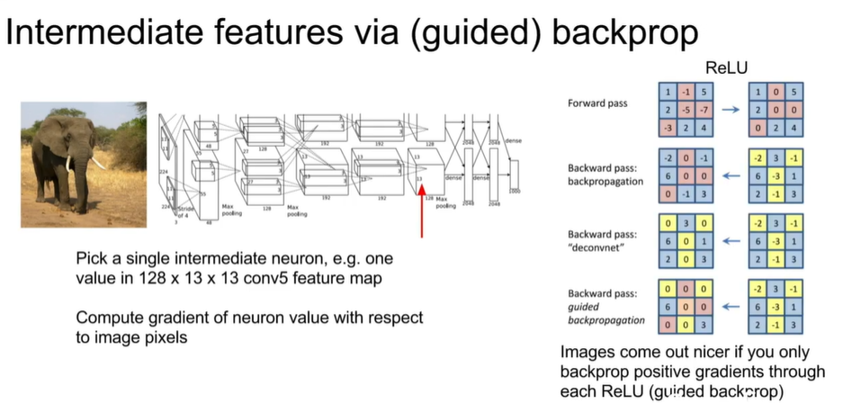
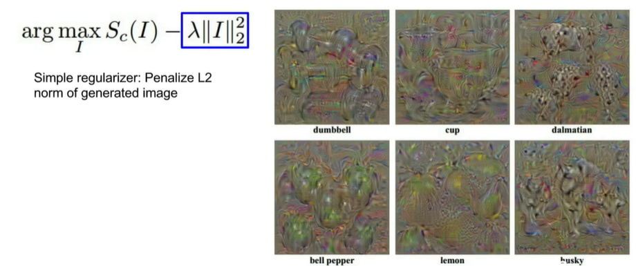
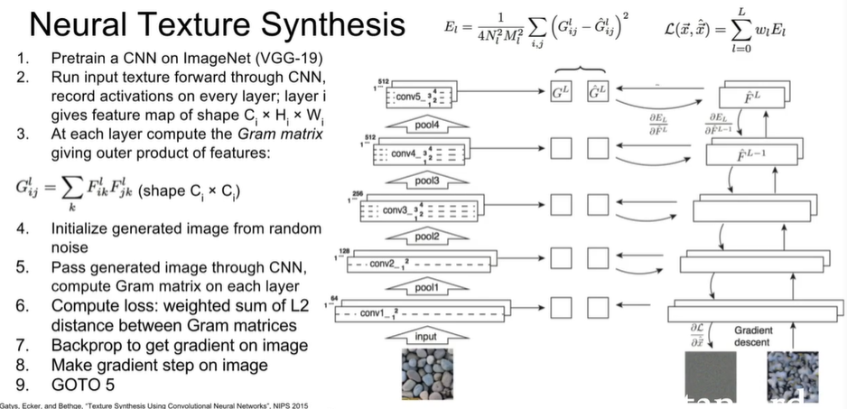

**2021-7-29**

# CS-231n L8 Detection and segmentation *CORE*

### Semantic segmentation

-  It does not differentiate instances, only care about pixels
- Label each pixel in the image with a category label

**Idea:** 

1. Sliding window, extract patches and classify center pixel with CNN.

This is expensive in the forward and backward passes

2. Fully connected layer: design a network as a bunch of convolutional layers to make predictions for pixels all at once
3. Design network as a bunch of convolutional layers, with Downsampling and Upsamping inside the network

The reason why we need to do this "Down-n-Up" trick is that the convolution operation for 64, 128 or 256 is really expensive!!!

**Downsample technique:** pooling, strided convolution

**Upsampling technique:** Unpooling, or strided transpose convolution 

### IN-Network upsampling : "Unpooling"

### Learnable Upsampling: Transpose Convolution

3 * 3 transpose convolution, stride 2 pad 1. Input gives weight for filter and Sum where output overlaps. Filter moves 2 pixels in the <u>output</u> for every once pixel in the <u>input</u>. Stride gives ratio between movement in output and input

2 * 2 -> 4 * 4

**Other names:**

- Deconvolution 
- Upconvolution
- Fractionally strided convolution
- Backward strided convolution

### Convolution as Matrix Multiplication

- we can express convolution in terms of a matrix multiplication
- Convolution transpose multiplies by the transpose of the same matrix

$\vec{x}*\vec{a}=X\vec{a}$

$\vec{x}*^T\vec{a}=X^T\vec{a}$

## Classification + Localization

- Treat localization as a regression problem

Have some other metric of performance that you care about other than the actual loss value which then you actually use that final performance metric to make your cross validation choices rather than looking at the value of the loss to make those choices.

#### Human Pose estimation

Categorical output: cross-entropy loss, softmax loss, SVM loss

Continuous output: L2, L1, smooth L1

## Object detection

Number of object is unknown, so this is a challenging problem!

Each image needs a different number of outputs

- Sliding window as before
- Problem: Need to apply CNN to huge number of locations and scales, very computationally expensive

#### Region proposals (classic algorithm for computer vision)

- Find "blobby" image regions that are likely to contain objects
- Relatively fast to run eg. selective search
- Also called Regions of Interest (RoI) from a proposal method

**Problems:**

- AD hoc training objectives
  - Fine-tune network with softmax classifier (log loss)
  - Train post-hoc linear SVMs
  - Train post-hoc bounding-box regressions (least squares)
- Training is slow, takes up a lot of space
- Inference (detection) is slow
  - 47s image with VGG16
  - Fixed by SPP-net

#### Fast R-CNN

- Forward whole image through Convnet
- ROLs on feature map of image
- RoL Pooling layer
- FC layers
- The use linear + softmax classifier for classification// Linear Reg
- Multi-task loss and backpropagate the whole process

### Detection without Proposals: YOLO/SSD

ssd: single shot multibox detection

**Aside: Object Detection + Captioning = Dense Captioning**

# L12 Visualizing and Understanding

- A good question to ask, what is going on inside ConvNets?
- What are the intermediate features looking for from Image to Classes?

### First Layer: visualize filters

visualizing the weight of the filter indicates what the filter is looking for.

### Last Layer

- 4096-dimensional feature vector for an image (layer immediately before the classifier)
- Run the network on many images, collect the feature vectors
- Since the dimensionality is pretty high, we adopt dimensionality reduction approach (PCA, t-SNE) Visualize the "space" of FC7 feature vectors by reducing dimensionality of vectors from 4096 to 2 dimensions

[**PCA**](http://www.stat.columbia.edu/~fwood/Teaching/w4315/Fall2009/pca.pdf) classic paradigm

[t-SNE](http://www.cs.toronto.edu/~hinton/absps/tsne.pdf) (t-distributed Stochastic Neighbor Embedding). This is a non-linear algorithm. 

### Maximally Activating Patches

- Pick a layer and a channel
- Run many images through the network, record values of chosen channel
- visualize image patches that correspond to maximal activations

### Occlusion Experiments

- Mask part of the image before feeding to CNN, draw heatmap of probability at each mask locations

### Saliency Maps

- How to tell which pixels matter for classification? (image to dog)
- Compute gradient of (unnormalized) class score with respect to image pixels, take absolute value and max over RGB channels

### Visualizing CNN features: gradient ascent

**Guided backprop:** find the part of an image that a neuron responds to 

**Gradient ascent:** generate a synthetic image that maximally activates a neuron

$I^* -argmax_If(I)+R(I)$ regularize to prevent the model overfitting the peculiarity part of the network.​

- First term is the neuron value and the second is natural image regularizer

1. Initialize image to zeros, Then repeat 2,3,4
2. Forward image to compute current scores
3. Backprop to get gradient of neuron value with respect to image pixels
4. Make a small update to the image

Better regularizer: Penalize L2 norm of image; also during optimization periodically

1. Gaussian blur image
2. Clip pixels with small values to 0
3. Clip pixels with small gradients to 0

#### Fooling Images / Adversarial Examples

1. start from an arbitrary image
2. pick an arbitrary class
3. modify the image to maximize the class
4. repeat until network is fooled

> Common criticism of Deep Learning: we don't trust the network because we don't understand as people why it's making decisions per se.

#### DeepDream

Rather than synthesizing an image to maximize a specific neuron, instead try to **amplify** the neuron activations at some layer in the network

Choose an image and a layer in a CNN; repeat

1. Forward: compute activations at chosen layer
2. Set gradient of chosen layer equal to its activation
3. Backward: compute gradient on image\
4. Update

### Feature Inversion

Given a CNN feature vector for an image, find a new image that:

- Matches the given feature vector
- look natural (image prior regularization)

### Texture synthesis

Given a sample patch of some texture, can we generate a bigger image of the same texture?

- Nearest neighbor approach
- Neural texture synthesis: Gram Matrix
  - Each layer of CNN gives C * H * W tensor of features; H * W grid of C - dimensional vectors
  - Outer product of two C-dimensional vectors gives C * C matrix measuring co-occurrence
  - Average over all HW pairs of vectors, giving **Gram matrix** of shape C * C 

Reconstructing texture from higher layers recovers larger features from the input texture

**Problems:** Style transfer requires many forward/backward passes through VGG SLOW!!!

### Fast Style Transfer

Replacing batch normalization with Instance Normalization improves results

[**One Network, Many styles**](https://arxiv.org/pdf/1610.07629.pdf)

## Summary

Many methods for understanding CNN representations

- **Activations:** Nearest neighbors, Dimensionality reduction, maximal patches, occlusion
- **Gradients:** Saliency maps, class visualization, fooling images, feature inversion
- Deep dream and style transfer